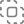

# ULogViewer クイックスタートガイド
 ---
+ [ログプロファイルの選択](#ログプロファイルの選択)
+ [ログプロファイルの作成と編集](#ログプロファイルの作成と編集)
+ [ログの読み取りを開始](#ログの読み取りを開始)
+ [ログのマーク](#ログのマーク)
+ [ログのフィルタ](#ログのフィルタ)

## ログプロファイルの選択
ログの読み込みと表示を始めるには、まずログプロファイルを選択する必要があります。
ログプロファイルを選択または変更するには 3 つの方法があります。

### ログプロファイル選択メニュー
1. ツールバーの  の横にあるドロップダウン矢印をクリックします。
2. ログプロファイルを選択します。

### ログプロファイル選択ダイアログ
1. ツールバーの  をクリックします。
2. ログプロファイルを探します。
3. ログプロファイルをダブルクリックするか、選択して [OK] をクリックします。

### ログプロファイルを指定して新しいタブを開く
1. タブバーの末尾にある  を右クリックします。
2. ログプロファイルを選択します。

[先頭に戻る](#-ulogviewer-クイックスタートガイド)

## ログプロファイルの作成と編集
必要に応じて、ログプロファイルの作成や変更が必要になる場合があります。
ログプロファイルの詳細については [こちら](https://carinastudio.net/ULogViewer/HowToReadAndParseLogs) をご参照ください。

### 現在のログプロファイルを編集する
1. ツールバーの  の横にあるドロップダウン矢印をクリックします。
2. ***'(名前)' を編集…*** をクリックします。組み込みのログプロファイルは編集できませんのでご注意ください。組み込みのログプロファイルをコピーするには、[既存のログプロファイルをコピーする](#既存のログプロファイルをコピーする) をご参照ください。

### ログプロファイルを編集する
1. ツールバーの  をクリックします。
2. ログプロファイルを探します。
3. ログプロファイルにポインタを重ねて  をクリックします。

### 新しいログプロファイルを作成する
1. ツールバーの  をクリックします。
2. [作成…] をクリックします。

### 現在のログプロファイルをコピーする
1. ツールバーの  の横にあるドロップダウン矢印をクリックします。
2. ***'(名前)' をコピー…*** をクリックします。

### 既存のログプロファイルをコピーする
1. ツールバーの  をクリックします。
2. ログプロファイルを探します。
3. ログプロファイルにポインタを重ねて  をクリックします。

### 既存のログプロファイルをインポートする
1. ツールバーの  をクリックします。
2. [インポート…] をクリックします。

[先頭に戻る](#-ulogviewer-クイックスタートガイド)

## ログの読み取りを開始
各ログプロファイルには、ファイル、ディレクトリ、IP エンドポイントなど、ログの読み取りを開始するために必要なパラメータが定義されています。
実行するコマンドなど、ログの読み取りを開始するために適切なパラメータがログプロファイルにすでに設定されている場合は、パラメータを設定する必要はありません。

ログの読み取りを開始する前に設定を求められる可能性があるパラメータは次のとおりです。

### ファイル
#### 1 つ以上のファイルを追加する
ULogViewer にファイルを追加するには 2 つの方法があります。
+ ツールバーの  をクリックし、1 つ以上のファイルを選択します。
+ エクスプローラー (macOS では Finder) から 1 つ以上のファイルを ULogViewer の作業領域にドラッグします。

#### 追加したファイルをすべて削除する
1. ツールバーの  をクリックします。

#### 追加したファイルを削除する
1. サイドバーの  をクリックして ***追加されたログファイル*** パネルを開きます。
2. ファイルを右クリックします。
3. ***ログファイルを削除*** をクリックします。

### 作業ディレクトリ
1. ツールバーの  をクリックします。
2. ディレクトリを選択します。

### コマンド
1. ツールバーの  をクリックします。
2. 実行するコマンドを設定します。

### IP エンドポイント
1. ツールバーの  をクリックします。
2. IP アドレスとポートを設定します。

### URI
1. ツールバーの  をクリックします。
2. URI を設定します。

### プロセス識別子 (PID)
1. ツールバーの  をクリックします。
2. プロセス識別子を設定します。

### プロセス名
1. ツールバーの  をクリックします。
2. プロセス名を設定します。

[先頭に戻る](#-ulogviewer-クイックスタートガイド)

## ログのマーク
気になるログを 1 つ以上マークしておくと、あとで見つけやすくなります。
マークしたログはすべて ***マークされたログ*** パネルに一覧表示されます。
ファイルから読み取ったログの場合、マークは保持されます。

### マークされたログパネルを開く
1. サイドバーの  をクリックします。

### ログをマーク/マーク解除する
ログをマーク/マーク解除するには 4 つの方法があります。
+ 1 つ以上のログを選択し、`M` キーを押してマーク/マーク解除します。
+ 選択したログを右クリックし、***ログをマーク > 色なし*** または ***ログのマークを解除*** をクリックします。
+ ログの左側にある  をクリックします。
+ ログの左側にある  を右クリックし、***色なし*** または ***ログのマークを解除*** をクリックします。

### 色を付けてログをマークする
色を付けてログをマークするには 3 つの方法があります。
+ 1 つ以上のログを選択し、`Ctrl+Alt+1`〜`Ctrl+Alt+8` (macOS では `⌥⌘1`〜`⌥⌘8`) を押して色を付けてマークします。
+ 選択したログを右クリックして ***ログをマーク*** をクリックし、色をクリックします。
+ ログの左側にある  を右クリックし、色をクリックします。

[先頭に戻る](#-ulogviewer-クイックスタートガイド)

## ログのフィルタ
ログのフィルタは、ログから問題を見つけて分析するのに役立つ ULogViewer の最も重要な機能の 1 つです。

### テキストフィルタ
ログは、表示されているログプロパティとテキストフィルタに基づいてフィルタできます。
ログのフィルタ時には 1 つ以上のテキストフィルタを適用でき、それらは **OR/和集合** モードで評価されます。
既定では、テキストフィルタに一致したログが表示対象になります。特定のテキストフィルタに **ログ除外に使用** を設定すると、一致したログを除外することもできます。

#### テキストフィルタを設定する
1. `Ctrl+F` (macOS では `⌘F`) を押すか、ツールバーのテキストフィルタ入力欄をクリックします。
2. テキストフィルタを正規表現で入力します。ULogViewer での正規表現の使用方法については [こちら](https://carinastudio.net/ULogViewer/RegularExpressions) をご参照ください。

テキストフィルタ入力欄にフォーカスがある状態で `Up`/`Down` キーを押すと、現在のタブのテキストフィルタ履歴をたどれます。

#### テキストフィルタを保存する
テキストフィルタを保存するには 3 つの方法があります。
+ ツールバーのテキストフィルタ入力欄にフォーカスを合わせ、**Ctrl+S** (macOS では **⌘S**) を押します。あらかじめテキストフィルタを設定しておく必要がありますのでご注意ください。
+ ツールバーの  をクリックし、[作成…] をクリックします。
+ **Ctrl+P** (macOS では **⌘P**) を押し、[作成…] をクリックします。

#### 保存したテキストフィルタを適用する
保存したテキストフィルタを適用するには 2 つの方法があります。
+ ツールバーの  をクリックし、1 つ以上のテキストフィルタを選択します。
+ **Ctrl+P** (macOS では **⌘P**) を押し、1 つ以上のテキストフィルタを選択します。

保存したテキストフィルタを複数選択するには、選択時に **Shift** または **Ctrl** (macOS では **⇧** または **⌘**) を押してください。

#### ログプロパティをテキストフィルタとして使用する
1. ログプロパティを右クリックします。
2. ***'(値)' でフィルタ*** をクリックし、精度を選択します。

### レベルフィルタ
1. ツールバーのレベルのドロップダウンボタンから、表示したいログレベルを 1 つ以上選択します。

レベルフィルタは、現在のログプロファイルに ***レベル*** ログプロパティが定義されている場合にのみ有効になりますのでご注意ください。

### プロセス識別子 (PID) フィルタ
PID フィルタを設定するには 2 つの方法があります。
+ ツールバーの PID 入力欄をクリックします。
+ 選択したログを右クリックし、***選択した PID でフィルタ*** または ***選択した PID のみでフィルタ*** をクリックします。

PID フィルタは、現在のログプロファイルに ***ProcessId*** ログプロパティが定義されている場合にのみ有効になりますのでご注意ください。

### スレッド識別子 (TID) フィルタ
TID フィルタを設定するには 2 つの方法があります。
+ ツールバーの TID 入力欄をクリックします。
+ 選択したログを右クリックし、***選択した TID でフィルタ*** または ***選択した TID のみでフィルタ*** をクリックします。

TID フィルタは、現在のログプロファイルに ***ThreadId*** ログプロパティが定義されている場合にのみ有効になりますのでご注意ください。

### テキストフィルタとその他のフィルタの組み合わせ
レベル、PID、TID のフィルタは **AND** モードで評価され、テキストフィルタは **OR/和集合** モードで評価されます。
ツールバーのテキストフィルタ入力欄とその他のフィルタ欄の間にあるボタンをクリックすると、テキストフィルタとその他のフィルタの組み合わせ方を選択できます。
+  自動。
+  OR/和集合。
+  AND/積集合。

### マークされたログのみを一時的に表示する
1 つ以上のフィルタが適用されているときに、マークされたログのみを一時的に表示できます。
切り替えるには 2 つの方法があります。
+ `Alt+M` (macOS では `⌥M`) を押します。
+ ツールバーの  をクリックします。

### すべてのログを一時的に表示する
1 つ以上のフィルタが適用されているときに、すべてのログを一時的に表示できます。
切り替えるには 2 つの方法があります。
+ `Alt+A` (macOS では `⌥A`) を押します。
+ ツールバーの  をクリックします。

### すべてのフィルタをクリアする
1. ツールバーの  をクリックします。

[先頭に戻る](#-ulogviewer-クイックスタートガイド)
