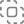

# Quick-Start Guide for ULogViewer
 ---
+ [Select a Log Profile](#select-a-log-profile)
+ [Create or Edit a Log Profile](#create-or-edit-a-log-profile)
+ [Start Reading Logs](#start-reading-logs)
+ [Mark Logs](#mark-logs)
+ [Filter Logs](#filter-logs)

## Select a Log Profile
To start loading and viewing logs, you need to select a log profile first. 
There are 3 ways to select or change log profile:

### Log Profile Selection Menu
1. Click the drop-down arrow next to  on the toolbar.
2. Select a log profile.

### Log Profile Selection Dialog
1. Click  on the toolbar.
2. Find a log profile.
3. Double-click the log profile, or select it and click [OK].

### New Tab with Log Profile
1. Right-click  at the end of the tab bar.
2. Select a log profile.

[Back to Top](#-quick-start-guide-for-ulogviewer)

## Create or Edit a Log Profile
You may need to create or modify a log profile in order to match your requirement. 
Please refer to [here](https://carinastudio.azurewebsites.net/ULogViewer/HowToReadAndParseLogs) for more information about log profiles.

### Edit the Current Log Profile
1. Click the drop-down arrow next to  on the toolbar.
2. Click ***Edit '(Name)' …***. Please note that built-in log profiles cannot be edited. To copy a built-in log profile, please refer to [Copy Existing Log Profile](#copy-existing-log-profile).

### Edit a Log Profile
1. Click  on the toolbar.
2. Find the log profile.
3. Hover over the log profile and click .

### Create a New Log Profile
1. Click  on the toolbar.
2. Click [Create…].

### Copy the Current Log Profile
1. Click drop-down arrow next to  on the toolbar.
2. Click ***Copy '(name)' …***.

### Copy Existing Log Profile
1. Click  on the toolbar.
2. Find the log profile.
3. Hover over the log profile and click .

### Import Existing Log Profile
1. Click  on the toolbar.
2. Click [Import…].

[Back to Top](#-quick-start-guide-for-ulogviewer)

## Start Reading Logs
Each log profile defines the parameters needed to start reading logs, such as a file, a directory or an IP endpoint.
You don't need to set up parameters if the log profile already has the proper parameters to start reading logs, such as the command to be executed.

The following are parameters you may be asked to set up before starting to read logs:

### File
#### Add One or More Files
There are 2 ways to add files to ULogViewer:
+ Click  on the toolbar and select one or more files. 
+ Drag one or more files from File Explorer (Finder on macOS) to the working area in ULogViewer.

#### Clear Added Files
1. Click  on the toolbar.

#### Remove Added File
1. Click  on the sidebar to open the ***Added Log Files*** panel.
2. Right-click on the file.
3. Click ***Remove Log File***.

### Working Directory
1. Click  on the toolbar.
2. Select a directory.

### Command
1. Click  on the toolbar.
2. Set up the command to be executed.

### IP Endpoint
1. Click  on the toolbar.
2. Set IP address and port.

### URI
1. Click  on the toolbar.
2. Set the URI.

### Identifier of Process (PID)
1. Click  on the toolbar.
2. Set the process identifier.

### Name of Process
1. Click  on the toolbar.
2. Set the process name.

[Back to Top](#-quick-start-guide-for-ulogviewer)

## Mark Logs
You can mark one or more logs of interest to make them easier to find later.
All marked logs will be listed in the ***Marked Logs*** panel.
Marked logs will be kept if the logs are read from files.

### Open the Marked Logs Panel
1. Click  on the sidebar.

### Mark/Unmark Logs
There are 4 ways to mark/unmark logs:
+ Select one or more logs and press `M` to mark/unmark them.
+ Right-click on the selected logs and click ***Mark Logs > No Color*** or ***Unmark Logs***.
+ Click  on the left-hand side of the logs.
+ Right-click  on the left-hand side of the logs, and click ***No Color*** or ***Unmark Logs***.

### Mark Logs with Color
There are 3 ways to mark logs with color:
+ Select one or more logs and press `Ctrl+Alt+1`-`Ctrl+Alt+8` (`⌥⌘1`-`⌥⌘8` on macOS) to mark them with color.
+ Right-click on the selected logs and click ***Mark Logs***, then click a color.
+ Right-click  on the left-hand side of the logs, and click a color.

[Back to Top](#-quick-start-guide-for-ulogviewer)

## Filter logs
Log filtering is one of the most important features in ULogViewer that helps you find and analyze problems from the logs.

### Text Filters
Logs can be filtered according to visible log properties and text filters.
One or more text filters can be applied when filtering logs, and they will be evaluated in **OR/Union** mode.
By default, logs will be included if they match the text filter. You can also enable **Used to Exclude Logs** for specific text filters to exclude matching logs.

#### Set Text Filter
1. Press `Ctrl+F` (`⌘F` on macOS) or click on the text filter input field on the toolbar.
2. Enter the text filter in Regular Expression. Please refer to [here](https://carinastudio.azurewebsites.net/ULogViewer/RegularExpressions) for more information about using Regular Expressions in ULogViewer.

You can press the `Up`/`Down` keys when focusing on the text filter input field to navigate through the text filter history in the current tab.

#### Save Text Filter
There are 3 ways to save a text filter:
+ Focus on the text filter input field on the toolbar and press **Ctrl+S** (**⌘S** on macOS). Please note that you need to set a text filter first.
+ Click  on the toolbar and click [Create…]. 
+ Press **Ctrl+P** (**⌘P** on macOS) and click [Create…].

#### Apply Saved Text Filters
There are 2 ways to apply saved text filters:
+ Click  on the toolbar and select one or more text filters.
+ Press **Ctrl+P** (**⌘P** on macOS) and select one or more text filters.

To select multiple saved text filters, please press **Shift** or **Ctrl** (**⇧** or **⌘** on macOS) when selecting.

#### Use Log Property as Text Filter
1. Right-click on a log property.
2. Click ***Filter by '(Value)'*** and select an accuracy level.

### Level Filter
1. Select one or more log levels you want to see from the levels drop-down button on the toolbar.

Please note that the level filter will be valid only when ***Level*** log property has been defined in the current log profile.

### Process Identifier (PID) Filter
There are 2 ways to set the PID filter:
+ Click the PID input field on the toolbar.
+ Right-click on the selected logs and click ***Filter by Selected PID*** or ***Filter by Selected PID Only***.

Please note that the PID filter will be valid only when ***ProcessId*** log property has been defined in the current log profile.

### Thread Identifier (TID) Filter
There are 2 ways to set the TID filter:
+ Click the TID input field on the toolbar.
+ Right-click on the selected logs and click ***Filter by Selected TID*** or ***Filter by Selected TID Only***.

Please note that the TID filter will be valid only when ***ThreadId*** log property has been defined in the current log profile.

### Combination of Text Filters and Other Filters
Level, PID, and TID filters are evaluated in **AND** mode, and text filters are evaluated in **OR/Union** mode.
You can choose how to combine text filters and other filters by clicking the button between the text filter input field and the other filter fields on the toolbar:
+  Auto.
+  OR/Union.
+  AND/Intersection.

### Show Only Marked Logs Temporarily
You can temporarily show only marked logs when one or more filters are applied.
There are 2 ways to toggle:
+ Press `Alt+M` (`⌥M` on macOS).
+ Click  on the toolbar.

### Show All Logs Temporarily
You can temporarily show all logs when one or more filters are applied.
There are 2 ways to toggle:
+ Press `Alt+A` (`⌥A` on macOS).
+ Click  on the toolbar.

### Clear All Filters
1. Click  on the toolbar.

[Back to Top](#-quick-start-guide-for-ulogviewer)